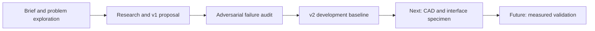

# AMRX

### Modular AMR platform for smart warehouse automation

[](https://github.com/Girish-0/AMRX/actions/workflows/repository-quality.yml)

**SIH26112 · Autodesk Fusion hardware track · Team AMRX · AU/SIH/26-126**

AMRX explores a common mobile robot base with interchangeable warehouse attachments: a powered tote conveyor and a passive carrier. The proposed structure combines conventional aluminium members with selectively additively manufactured junctions, replaceable interface wear parts, and accessible service spaces.

> **Current stage: concept and engineering planning.** The repository contains research, design proposals, a failure audit, and a revised development baseline. No native CAD assembly, reproducible solver study, firmware, or physical test record is included. Capacity and performance figures are targets, not demonstrated results.

## Start here

| Your question | Read |
|---|---|
| What is the project, and what exists today? | [Current status and evidence](docs/STATUS.md) |
| Where did the idea start, and why did it change? | [Project evolution](docs/history/README.md) |
| What is the current engineering direction? | [Architecture overview](docs/engineering/ARCHITECTURE.md) → [Full v2 roadmap](docs/engineering/roadmap-v2.md) |
| What will happen next? | [Roadmap and verification gates](ROADMAP.md) |
| What were the weaknesses in the earlier proposal? | [Failure audit](docs/reviews/adversarial-failure-audit.md) |
| Where are all the original files? | [Document library](docs/README.md) · [Import provenance](docs/provenance/README.md) |
| How do I contribute or review a change? | [Contribution workflow](CONTRIBUTING.md) |

## From concept to evidence



The diagram shows the document narrative, not a dated record of completed hardware. The [history guide](docs/history/README.md) explains which dates are known and which stages are inferred from document contents.

## Development baseline

The [v2 roadmap](docs/engineering/roadmap-v2.md) proposes an 800 × 600 mm base, a 500 × 400 mm interface grid, manual positively retained clamps, a powered conveyor, and a passive carrier using the same interface. Its **250 kg total top-load** and **50 kg conveyor cargo** values are separate design targets. They are not operating ratings.

Earlier carbon-fibre configurations, automatic exchange concepts, universal compatibility claims, and unsupported performance figures remain visible in the historical record; they do not define the current baseline. All engineering gates G0–G8 remain open.

## Repository map

```text
.github/          Issue forms, PR template, ownership, and CI
scripts/          Repository integrity and documentation checks
docs/
  brief/          Supplied challenge brief
  research/       Problem exploration and source studies
  history/        Evolution guide and preserved v1 proposals
  reviews/        Adversarial failure audit
  engineering/    Current v2 baseline and architecture overview
  decisions/      Recorded repository and engineering decisions
  validation/     Evidence conventions and test-record template
  provenance/     Original filenames, SHA-256 hashes, import manifest
presentation/     Original proposal deck and presentation status
```

## Working locally

No robot software or simulation can be run from this snapshot. To inspect the documentation and run the repository checks, install Git and Python 3.11 or newer:

```bash
git clone https://github.com/Girish-0/AMRX.git
cd AMRX
python scripts/check_repository.py
```

No third-party Python packages are required. CI checks source integrity, maintained relative links, required files, file-size limits, and obvious accidentally committed credentials. Passing CI says nothing about mechanical safety or hardware performance.

## Project stewardship

Changes follow **issue → branch → pull request → checks → maintainer review → merge**. Technical claims need linked evidence and an explicit status. See [CONTRIBUTING](CONTRIBUTING.md), [security reporting](SECURITY.md), and [reuse status](docs/LICENSING.md).

The supplied challenge brief contains submission and originality conditions. This repository is a research/development record; the team must confirm current organizer requirements before submitting qualifying work. Repository organization does not certify submission eligibility.
