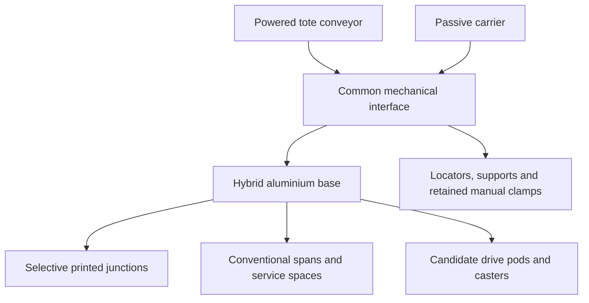

# Proposed system architecture

**Source:** [Revised engineering roadmap v2](roadmap-v2.md). **Status:** concept baseline, not released hardware.

| Subsystem | Proposed direction | Evidence needed before release |
|---|---|---|
| Part A structure | Conventional 6061-T6 spans with selective AlSi10Mg LPBF junctions | Native CAD, joint checks, matched baseline study and process feasibility |
| Common interface | Round/diamond location; three primary supports and adjustable fourth; four manually operated clamps with secondary retention | Tolerances, contact sequence, retention and repeatability tests |
| Part B conveyor | Eight rollers; single-tote transfer along ±Y; 50 kg cargo target | Geometry, load/actuation calculations, cargo retention and guarded workability evidence |
| Second attachment | Passive carrier sharing the same interface | Independent module model and unchanged-base fit proof |
| Exchange | Supported, power-isolated manual procedure | Handling envelope, support fixture and repeatable seating procedure |
| Ground support | Candidate central sprung drive pods and passive casters | Wheel reactions, traction, stability and braking analysis |
| Demonstrator | Scaled polymer parts where appropriate | Declared scale, material/process limits and controlled test plan |

The 800 × 600 mm base and 500 × 400 mm interface are packaging targets. The 250 kg total top-load includes attachment and cargo; it is not the conveyor cargo rating. Full-scale metal concept and scaled polymer demonstration must have separate evidence and limits.

Custom autonomy, automated module changing and industrial certification are deferred. A functional mechanical concept does not establish autonomous navigation capability.
